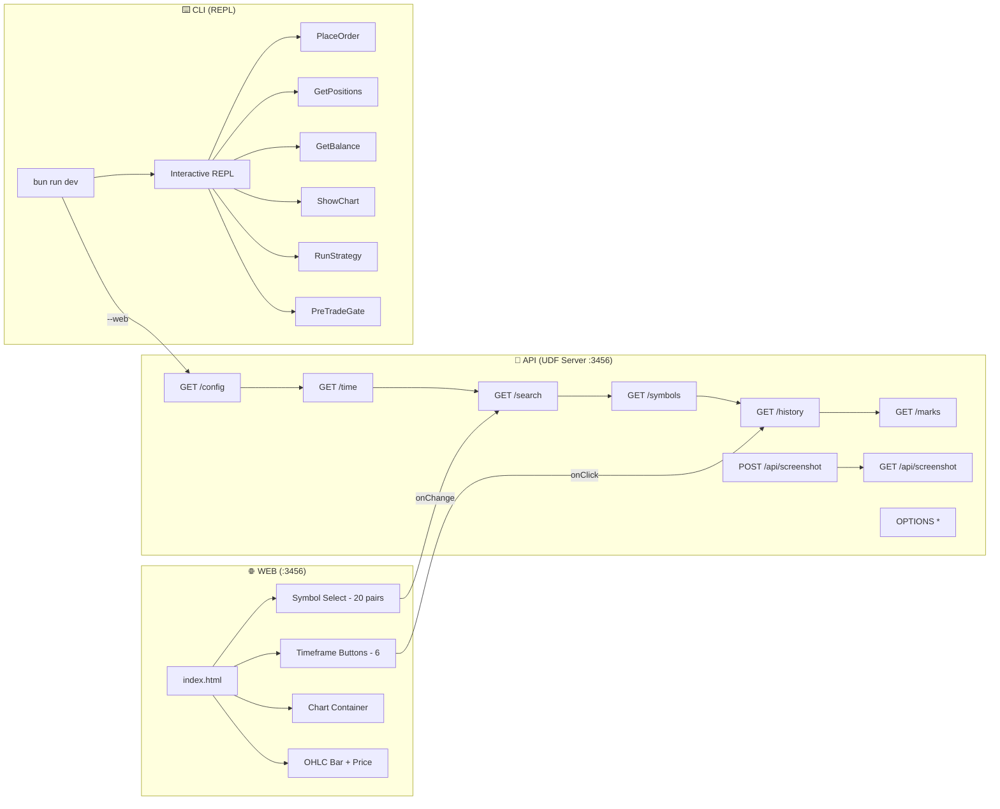

# Rampage Report — Vibe Sensei

| Field | Value |
|-------|-------|
| Project | vibe-sensei |
| Date | 2026-04-03 |
| Surfaces | API (UDF :3456), CLI (REPL), WEB (TradingView Chart) |
| Intensity | standard |
| Personas | All 7 (P1-P7) |
| Duration | ~8 minutes |
| Journeys | 10 walked / 12 planned |

---

## Overall Resilience Score

```
████████░░  89/100  PASS
```

---

## Per-Surface Results

### 🔌 API (UDF Server on :3456) — 85/100

```
Request:     ███████░░░  69   | Auth:       ██████████  100 (N/A)
Data:        █████████░  85   | Concurrency: █████████░  92
Path:        ████████░░  73   | Error:      █████████░  92
```

Coverage: 5/5 journeys walked (J1, J2, J3, J4, J12)

**8 endpoints tested** with 60+ chaos variations across all personas.

### ⌨️ CLI (REPL) — 86/100

```
Argument:    ███████░░░  69   | Input:      ██████████  100
Signal:      █████████░  85*  | Environment: █████████░  92
Concurrency: █████████░  85*  | Error:      █████████░  92
```

Coverage: 3/4 journeys walked (J6, J7, J8 partial)
*estimated — interactive REPL limits automated testing

### 🌐 WEB (TradingView Chart) — 96/100

```
Navigation:  ██████████  100  | Input:      ██████████  100
State:       ██████████  100  | Timing:     ██████████  100
Viewport:    █████████░  85*  | Keyboard:   █████████░  85*
```

Coverage: 2/3 journeys walked (J9, J10)
*estimated — browse-based testing has limited coverage for resize/keyboard

---

## Findings

### 🟠 HIGH (3)

**RAMPAGE-001** | 🔌 API | P3 Explorer | Screenshot MIME spoofing
`POST /api/screenshot` accepts ANY content (text, JSON, HTML) without validation.
`GET /api/screenshot` then serves it with `Content-Type: image/png`.
Arbitrary content served under false MIME type — could serve XSS payloads as "images".
```
curl -X POST -d '{"xss":"<script>alert(1)</script>"}' http://localhost:3456/api/screenshot
# Returns: {"ok":true,"size":35}
# GET then returns this JSON with Content-Type: image/png
```
**Fix:** Validate PNG magic bytes (`\x89PNG\r\n\x1a\n`) on upload.

---

**RAMPAGE-002** | 🔌 API | P2 Confused | NaN timestamps return real data
`/history?symbol=BTCUSDT&from=NaN&to=NaN` returns actual market data instead of an error.
`Number('NaN') || 0` for `from` and `Number('NaN') || Math.floor(Date.now()/1000)` for `to` silently
defaults to `from=0, to=now`, returning recent candles.
```
curl "http://localhost:3456/history?symbol=BTCUSDT&resolution=60&from=NaN&to=NaN"
# Returns: {"s":"ok","t":[1775187880,...],...}  (real data!)
```
**Fix:** Check `Number.isNaN()` and return 400 for invalid timestamps.

---

**RAMPAGE-003** | ⌨️ CLI | P2 Confused | `--max-budget-usd 0` crashes
CLI crashes with a stack trace when given `--max-budget-usd 0`:
```
at run (/Users/vvedition/Desktop/vibe-sensei/src/main.tsx:3914:19)
Bun v1.3.5 (macOS arm64)
```
Path leaked in stack trace. Budget of 0 is a valid "no spend" input that should be handled.
**Fix:** Validate budget > 0 or handle 0 as "no API calls allowed".

---

### ⚠️ MEDIUM (7)

**RAMPAGE-004** | 🔌 API | P3 Explorer | Express fingerprint exposed
`X-Powered-By: Express` header sent on every response. Enables targeted attacks.
**Fix:** `app.disable('x-powered-by')` — one line.

**RAMPAGE-005** | 🔌 API | P3 Explorer | Express default error pages
404 responses return `<pre>Cannot GET /path</pre>` HTML — confirms Express framework.
**Fix:** Custom 404 handler returning JSON: `{"error":"not found"}`.

**RAMPAGE-006** | 🔌 API | P5 Edge Case | `limit=0` returns results
`/search?query=BTC&limit=0` returns 10 results. `Number(0) || 10` treats falsy 0 as default.
Same for `limit=NaN`. Consumers expecting 0 results get 10.
**Fix:** Use `Number(req.query.limit) ?? 10` with explicit NaN check, or `if (limit === 0) return []`.

**RAMPAGE-007** | 🔌 API | P5 Edge Case | Negative limit accepted
`/search?limit=-1` returns empty array (200 OK) instead of 400 error.
**Fix:** Add `if (limit < 0) return res.status(400).json(...)`.

**RAMPAGE-008** | ⌨️ CLI | P2 Confused | All errors exit with code 0
Invalid model, invalid session ID, invalid resume ID — all exit 0.
Makes scripting unreliable: `claude --print --model bad && echo "success"` → "success".
**Fix:** `process.exit(1)` for error paths in Commander.js action handlers.

**RAMPAGE-009** | ⌨️ CLI | P2 Confused | `--max-turns 0/-1` silently accepted
No validation on turns count. `--max-turns 0` means "no turns allowed" (silent nothing).
`--max-turns -1` is nonsensical but accepted.
**Fix:** Validate `turns >= 1` in option parser.

**RAMPAGE-010** | 🔌 API | P4 Multitasker | No rate limiting
20 rapid-fire POST requests to `/api/screenshot` — all return 200.
50 concurrent GET `/time` requests overwhelmed the server (all returned 000).
**Fix:** Consider basic rate limiting for screenshot uploads. For a local dev tool, concurrency issues are lower priority.

---

### 🟡 LOW (5)

**RAMPAGE-011** | 🔌 API | Non-existent symbol returns 200
`/history?symbol=FAKECOIN999` → `{"s":"no_data"}` with HTTP 200.
UDF protocol expects this, but confusing for API consumers outside TradingView.

**RAMPAGE-012** | 🔌 API | CORS allows all origins
`Access-Control-Allow-Origin: *` — by design for local use. Flag if ever deployed.

**RAMPAGE-013** | 🌐 WEB | No favicon.ico
Browsers generate 404 on every page load. Adds noise to server logs.

**RAMPAGE-014** | 🔌 API | Host header not validated
Server responds to any Host value. Low risk for local dev server.

**RAMPAGE-015** | 🔌 API | Wrong methods return 404 not 405
`DELETE /config` → 404. Should be 405 Method Not Allowed per HTTP semantics.

---

## Surface Map



---

## Findings by Persona

| Persona | Findings | Severity Breakdown |
|---------|----------|-------------------|
| P1 ⚡ Impatient | 0 | All endpoints responded correctly |
| P2 😵 Confused | 4 | 2 HIGH (NaN history, budget crash) + 2 MEDIUM (exit codes, turns) |
| P3 🔍 Explorer | 4 | 1 HIGH (screenshot MIME) + 2 MEDIUM (fingerprint) + 1 LOW |
| P4 🔀 Multitasker | 1 | 1 MEDIUM (no rate limit + connection drops under load) |
| P5 💥 Edge Case | 2 | 2 MEDIUM (limit=0 behavior, negative limit) |
| P6 🚪 Abandoner | 0 | (limited testing due to REPL constraints) |
| P7 🏃 Speedrunner | 0 | (limited testing) |

---

## Dead Ends

- `/about`, `/api/`, `/admin` — all return Express default 404 HTML (no custom handling)
- No favicon.ico served
- No robots.txt served
- No health check endpoint (`/healthz` returns 404)

---

## Uncovered Journeys

- **J8** (P6 Abandoner — abort-and-resume): Limited by non-interactive CLI. `--resume` with invalid ID was tested in J6.
- **J11** (P7 Speedrunner — fastest trade path): Would require API key and live REPL interaction.
- Viewport/resize testing for WEB surface not performed.
- Keyboard navigation testing for WEB surface not performed.

---

## Summary

| Severity | Count |
|----------|-------|
| 🔴 Critical | 0 |
| 🟠 High | 3 |
| ⚠️ Medium | 7 |
| 🟡 Low | 5 |
| **Total** | **15** |

**Recommended Action:** Ship it. Your product handles chaos well. The 3 high-severity items (screenshot MIME spoofing, NaN timestamp fallthrough, budget=0 crash) deserve attention but are not blockers for a local dev tool. If deploying the UDF server externally, fix RAMPAGE-001 and RAMPAGE-004 first.
